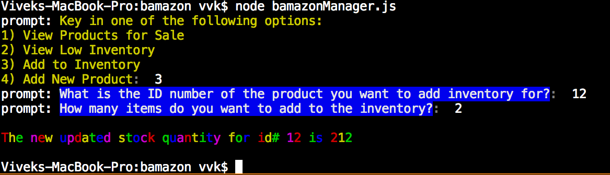

#bamazon

### Synopsis
***

An interactive shopping node app where MySQL and Node.JS are used to allow users to purchase items as a customer, view, track and update the product inventory as a manager, and track the total sales by department as an Supervisor.

##### bamazon Customer Portal
***

The bamazon Customer Portal allows users to view the current items available for purchase.  The user will be prompted to enter the item id# and how many items they wish to purchase.  If the item is in stock, the order will be completed and the user will see the total amount of their purchase.

##### bamazon Manager Portal
***

The bamazon Customer Portal allows users to view and edit the inventory of the store.  The user will be prompted to choose from the following options:
* View products for sale
* View low inventory
* Add to inventory
* Add a new product

###### Manager Options 1
***

The first option allows the user to see the list of products that are currently for sale, what department the item belongs to, the price of the product and how much stock is left for that product.

###### Manager Options 2
***

The second option allows the user to see a list of all inventory items that have less than 5 items in stock.  If there are no products that meet this criteria, the user will see an empty table.

###### Manager Options 3
***

The third option allows the user to update the inventory for a specific product.  A prompt asks what the id is for the product the user wants to update.  A second prompt asks how many items the user wishes to increase the quantity by.

###### Manager Options 4
***

The last option allows the user to add a new product to the inventory.  Prompts ask the user for the product id#, the product name, the department name, the price and the stock quantity.

##### bamazon Supervisor Portal
***

The bamazon Supervisor Portal allows users to view the total profits of the store categorized by department and add new departments.  

#### Contributors:
***

Vivek Malhan [GitHub](https://github.com/docvvk)

#### Technologies Used:
***

* Javascript
* nodeJS
* MySQL
* npm packages:
	- [mysql](https://github.com/felixge/node-mysql)
	- [prompt](https://github.com/flatiron/prompt)
	- [colors/safe](https://github.com/Marak/colors.js)
	- [cli-table](https://github.com/Automattic/cli-table)

#### License
***

Copyright 2018 UfT Coding Bootcamp - Vivek Malhan

